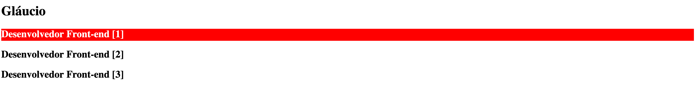
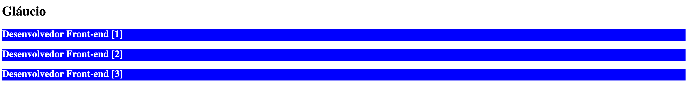

# Questão proposta

Explique, brevemente e com suas palavras, a finalidade e a diferença entre osseletores de CSS “+” e “~”.

### Resposta

São seletores para descrever estilo por herança, o '+', ele aplica o estilo somente para o próximo irmão especificado dele, exemplo:

```html
<style>
  h1 + h2 {
    background-color: red;
    color: #fff;
  }
</style>

<main>
  <h1>Gláucio</h1>
  <h2>Desenvolvedor Front-end [1]</h2>
  <h2>Desenvolvedor Front-end [2]</h2>
  <h2>Desenvolvedor Front-end [3]</h2>
</main>
```

#### Resultado no html



<hr>

e já o combinador geral de irmãos('~'), ele tem um comportamento similar, mas ele adiciona estilo a todos os irmão deles que respeite a regra descrita via seletor, exemplo:

```html
<style>
  h1 ~ h2 {
    background-color: blue;
    color: #fff;
  }
</style>

<main>
  <h1>Gláucio</h1>
  <h2>Desenvolvedor Front-end [1]</h2>
  <h2>Desenvolvedor Front-end [2]</h2>
  <h2>Desenvolvedor Front-end [3]</h2>
</main>
```
#### Resultado no html


